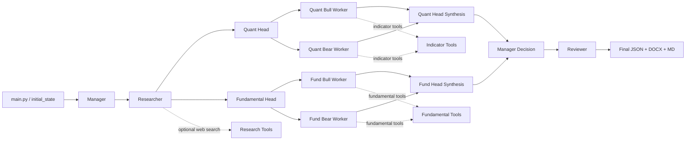

# ThinkerSwarmHF

ThinkerSwarmHF is a multi-agent trading analysis framework built around LangGraph. It combines a Researcher, Quantitative wing, Fundamental wing, Manager, and Reviewer to produce risk-managed trade setups plus written reports.

## What it does

- Pulls local library context from `library/`
- Runs technical and fundamental analysis in parallel
- Uses live indicator and valuation tools
- Optionally adds public web context for research
- Reads local fundamental data from `data/financials.db`
- Writes terminal output, `out.json`, `TICKER_analysis_report.docx`, and `TICKER_analysis_report.md`

## Codebase structure

```text
ThinkerSwarmHF/
├── main.py                     # CLI entry point and report generation
├── core/                       # LangGraph state and routing
│   ├── graph.py
│   └── state.py
├── agents/                     # Node logic for manager, researcher, heads, workers, reviewer
│   ├── specialists.py
│   ├── heads.py
│   ├── wing_workers.py
│   └── reviewer.py
├── tools/                      # Local tool implementations
│   ├── indicator_tools.py
│   ├── fundamental_tools.py
│   ├── research_tools.py
│   ├── file_tools.py
│   └── sandbox.py
├── skills/                     # Active runtime instructions for agents
│   ├── heads/
│   └── specialists/
├── prompts/                    # Legacy fallback instructions mirrored from skills/
├── indicators/                 # Generated / maintained indicator code
├── library/                    # Local research corpus and cached source material
├── data/                       # SQLite market and fundamental databases
└── README.md
```

## Runtime flow

1. `main.py` loads configuration and builds the initial state.
2. The Manager sets the market context and dispatches both wings.
3. The Researcher reads `library/`, builds peer context, and optionally adds web context.
4. The Quant wing evaluates regime, momentum, volatility, and structure tools.
5. The Fundamental wing builds valuation, cash flow, balance sheet, and peer-comparison cases using `data/financials.db` first.
6. The Manager reconciles both wings into a trade setup.
7. The Reviewer checks risk/reward and returns the final JSON decision.
8. `main.py` writes JSON, DOCX, and Markdown reports.



## Research and analysis inputs

- `skills/` is the preferred source of agent instructions.
- `prompts/` remains as a fallback mirror for compatibility.
- The Researcher always performs local sector/peer comparison.
- The Researcher and Fundamental wing prefer the local `financials.db` snapshot for valuation context.
- Web context is optional and enabled with `--research-web`.

## Reports

The report writers now produce both formats:

- `TICKER_analysis_report.docx`
- `TICKER_analysis_report.md`

Both reports include:

- run metadata
- final trade setup
- technical and fundamental wing highlights
- tool-call tables by node
- execution step summaries
- appendices with the full wing reports
- raw sector/peer context and raw internet search context when enabled

## Running the framework

Prerequisites:

- Python 3.10+
- `NVIDIA_API_KEY` in `.env`
- SQLite database in `data/US_DB.db` or another path passed with `--db`

Example:

```bash
python main.py --ticker MSFT
python main.py --ticker MSFT --research-web
python main.py --ticker MSFT --financial-db data/financials.db
python main.py --ticker MSFT --db data/US_DB.db --verbose
```

`--research-web` enables public web-search context for the Researcher node.

## Dependencies

Core dependencies:

- `langchain`
- `langchain-core`
- `langgraph`
- `langchain-nvidia-ai-endpoints`
- `pandas`
- `numpy`
- `python-dotenv`
- `python-docx`

## Notes

- The codebase is designed to keep tool use explicit and visible in the saved reports.
- The Quant path now prefers regime-first tool selection and includes structure-oriented tools such as Renko, Heikin-Ashi RSI, and WaveTrend.
- The Researcher can include sector peer snapshots and live public-news context when web search is enabled.
